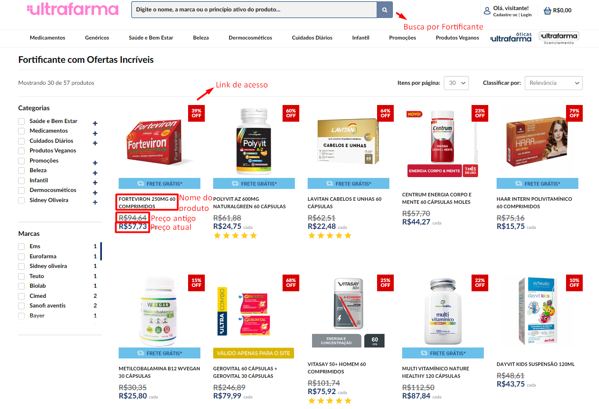
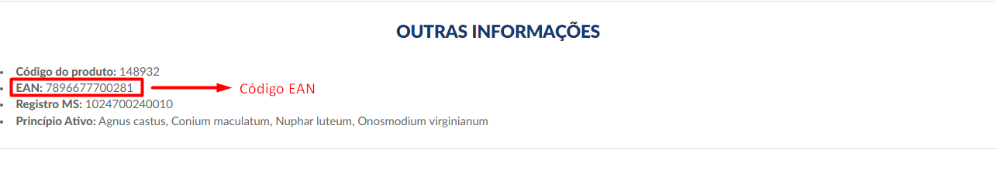
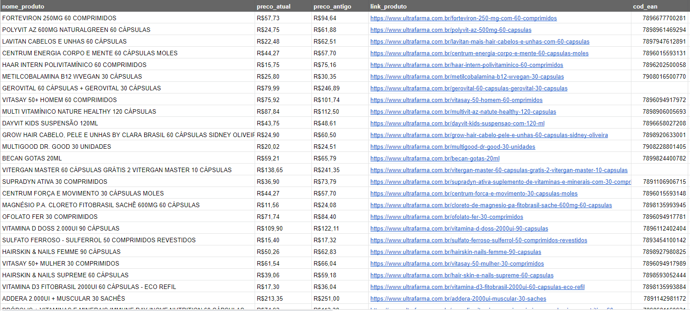

## Objetivo
Desenvolver um programa de formação de catálogo com a técnica de Web Scraper, é necessário ser possível buscar qualquer item no site da [UltraFarma](https://www.ultrafarma.com.br/), após definido o produto a ser buscado pelo programa, é necessário que o programa capture dados de todos os card's em todas as páginas. Em cada card de produto são coletados os dados de <b>nome do produto, preço atual do produto, preço antigo do produto, link/url do produto e o código EAN do produto</b>, esse código EAN é encontrado somente quando acessamos o produto, não existe essa informação no card.

<p align="center">
  <br>
  <b>UltraFarma - Busca por Fortificante</b>
</p>

<p align="center">
  <br>
  <b>Código EAN do produto</b>
</p>


## Solução proposta
<b>Stacks:</b> Python (os, requests, BeautifulSoup, pandas)

Funcionamento:
Inicialmente, para se definir o produto a ser pesquisado pelo web scraper no site da UltraFarma, devemos anexá-lo a variável <b>Item</b>, ele é encontrada na primeira linha do programa após as importações de bibliotecas. Após definido o produto a ser procurado, o programa fará o restante do trabalho automaticamente,  o produto definido na variável item é anexado ao link derequisição. 
```
item = 'fortificante'
url_pagina = f'https://www.ultrafarma.com.br/busca?resultsperpage=30&sortby=relevance&q={item}&page={"{}"}'
```
A arquitetura:
Executando o programa com o produto já definido na variável item, é feita uma primeira requisição que consegue coletar a quantidade de páginas que o programa terá que acessar para coletar dados de todos os card's encontrados.
```
response = requests.get(url_pagina.format(1))
soup = bs(response.text)
try:
    qtd_paginas = int(soup.find('ul', {'pagination pagination-vitrine'}).findAll('li')[-1].find('a')['data-pagina'])
except:
    qtd_paginas = 1
lista_products = []
```
Em  seguida, em um laço de repetição, o programa acessara todas as páginas coletando dados de todos os card's apresentados, esses dados são o <b>nome do produto, preço atual do produto, preço antigo do produto, link/url do produto</b>, após essa primeira captura de dados e com o dado de link de acesso de cada produto obtido, é feito um segundo laço de repetição, nele será feito uma requisição para cada produto unicamente, para que assim possamos capturar o <b>código EAN</b>  de cada produto.
```
for pagina in range(1,qtd_paginas+1):
    response = requests.get(url_pagina.format(pagina))
    soup = bs(response.text)
    products = soup.find_all('div', {'col-xs-6 col-sm-6 col-lg-2 prd-list-item'})
    for p in products:
        try:
            nome_produto = p.find('h3',{'class':'product-name font-bold'}).text.strip()
        except:
            nome_produto = None
        try:
            preco_atual = p.find('span',{'class':'product-price-sell'}).text.strip()
        except:
            preco_atual = None
        try:
            preco_antigo = p.find('span',{'class':'product-price-old'}).text.strip()
        except:
            preco_antigo = None
        try:
            link_produto = p.find('a', {'class': 'product-item-link in_stock'})['href']
        except:
            link_produto = None
        
        lista_products.append({'nome_produto':nome_produto, 'preco_atual':preco_atual, 'preco_antigo':preco_antigo, 'link_produto':link_produto})

    for i in range(len(lista_products)):
        url = lista_products[i]['link_produto']
        response = requests.get(url)
        soup = bs(response.text)
        try:
            codigo_ean = str(soup.find('div', {'id': 'pdp-section-outras-informacoes'}).findAll('span')[1].text.strip())[5:]
        except:
            codigo_ean = None
        lista_products[i]['cod_ean'] = codigo_ean
```
Após finalizado todas as capturas de dados, o programa estará no estágio em que possui todos os dados armazenados em uma variável de tipo dicionário, assim sendo, é realizado a conversão do dicionário para um DataFrame, e em seguida é exportado os dados para um arquivo <b>.csv</b> , a exportação do arquivo será feita de forma automática no diretório atual do script, esse arquivo irá possuir o nome de <b>products_nome do produto pesquisado</b>.

```
df_products = pd.DataFrame(lista_products)
absFilePath = os.path.dirname(os.path.realpath(__file__))
arq = f'{absFilePath}\products_{item}.csv'
df_products.to_csv(arq, encoding='utf-8', index=False, sep=';')
print(f'Arquivo products_{item}.csv Exportado!')
```


## Resultados
<b>Problemas resolvidos:</b> Para o programa finalizar com sucesso, é necessário fazer um grande número de requisições ao site, pois é necessário fazer uma requisição para coletar a quantidade de páginas, outras diversas requisições para acessar todas as paginas e coletar dados de todos os card's, e após  ter obi tido a url de acesso de cada produto, outras diversas requisições são feitas para acessar todos os produtos e ser possível coletar o código EAN de cada produto. Dessa forma, pode-se haver o bloqueio de requisições pelo site, que nada mais é o nosso bloquei de acesso, para se evitar esse problema, pode-se se utilizado uma VPN(Rede Privada Virtual), a VPN também pode ser utilizada para se fazer a requisição de outros estados, já que um mesmo produto pode ter um código EAN diferente em cada estado.


<b>Métricas de resultado:</b> É possível constatar o correto funcionamento do programa através da quantidade de registros no arquivo final '.csv', essa quantidade confere quando fazemos a busca pelo mesmo produto direto ao site, e se analisado manualmente, a quantidade de produtos apresentados no site confere com a quantidade de registro coletados. Os Dados coletados validados manualmente sempre estão corretos, o único problema é que alguns produtos não possuem código EAN, isso acontece por conta desse produto ser a junção de mais produtos em um único combo, nessa situação o programa seta o valor nulo para o código EAN.


<b>Resultado final - Arquivo '.csv':</b>

<p align="center">
  <br>
  <b>Dados finais - Extraídos buscando pelos produtos denidos como Fortificantes</b>
</p>
